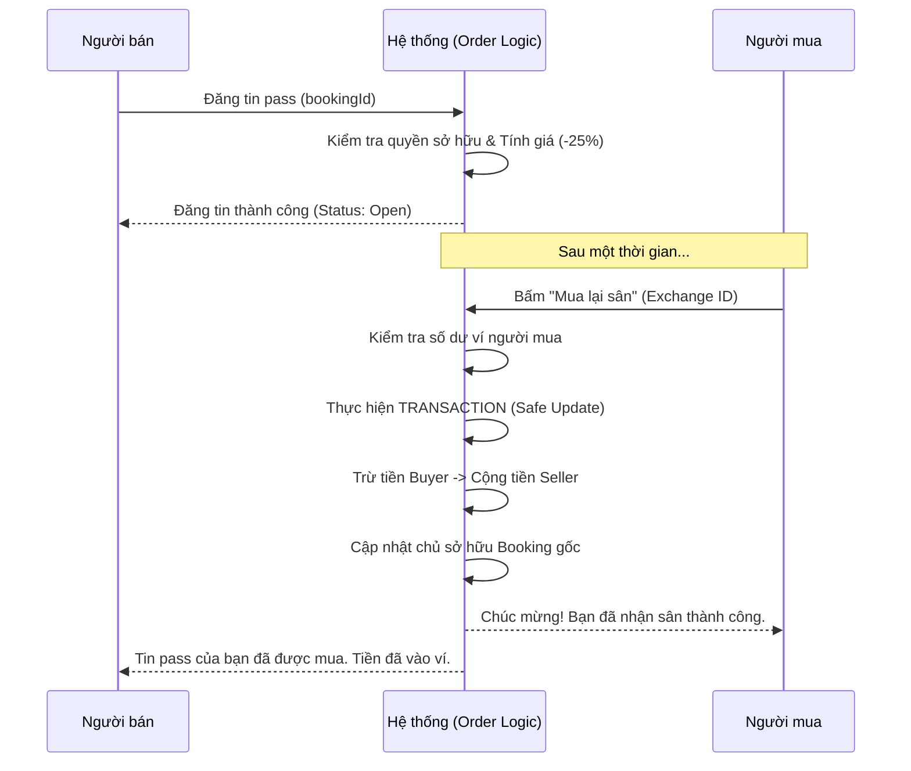

# 📘 Tài liệu chi tiết: Nghiệp vụ Pass Sân (Booking Exchange)

Tài liệu này mô tả chi tiết quy trình, logic và thiết kế kỹ thuật cho tính năng chuyển nhượng lại sân cầu lông giữa các người dùng.

---

## 🏗 1. Thiết kế Dữ liệu (Data Model)

### 👤 Thêm ví tiền cho User (`User` Model)
Mỗi người dùng sẽ có một ví tiền nội bộ (`balance`) để nhận tiền khi pass sân thành công.
```javascript
balance: { type: Number, default: 0, min: 0 }
```

### 🎫 Model Giao dịch (`BookingExchange` Model)
Lưu trữ các tin đăng "Pass sân".
| Trường | Kiểu | Mô tả |
| :--- | :--- | :--- |
| `bookingId` | ObjectId | Liên kết tới Booking gốc cần pass |
| `sellerId` | ObjectId | Người sở hữu hiện tại (Người bán) |
| `originalPrice`| Number | Giá trị gốc của sân (từ Booking) |
| `price` | Number | Giá bán lại (Luôn = 75% giá gốc) |
| `status` | String | `Open` (đang rao), `Completed` (đã pass), `Cancelled` (hủy) |
| `buyerId` | ObjectId | Người mua (null nếu chưa có người mua) |

---

## 🔄 2. Quy trình Nghiệp vụ (Workflows)

### 📤 A. Nghiệp vụ Đăng tin Pass Sân
Người dùng có việc bận muốn bán lại suất đặt sân của mình.

1. **Điều kiện**:
   - Booking phải thuộc quyền sở hữu của người gọi API.
   - Trạng thái Booking phải là `Confirmed`.
   - Thời gian đặt sân phải còn hiệu lực (không thể pass sân đã qua giờ).
   - Booking chưa được đăng pass trước đó (hoặc tin đăng cũ đã bị hủy).
2. **Logic hệ thống**:
   - Lấy `totalPrice` từ Booking gốc. 
   - Tính toán giá pass: `price = totalPrice * 0.75`.
   - Tạo bản ghi `BookingExchange` mới với `status: 'Open'`.
   - (Tùy chọn) Đánh dấu `Booking` gốc đang trong trạng thái "Đang rao bán" nếu cần.

### 📥 B. Nghiệp vụ Mua lại sân (Take over)
Người dùng khác muốn mua lại suất pass sân để chơi.

1. **Điều kiện**:
   - Người mua phải có đủ số dư trong ví (`user.balance >= exchange.price`).
   - Tin pass phải đang ở trạng thái `Open`.
   - Người mua không được là người bán.
2. **Logic hệ thống (Atomic Transaction)**:
   - **B1: Trừ tiền người mua**: `buyer.balance -= price`.
   - **B2: Cộng tiền người bán**: `seller.balance += price`.
   - **B3: Đổi chủ Booking**: Cập nhật `Booking.userId = buyerId`.
   - **B4: Đóng giao dịch**: `BookingExchange.status = 'Completed'`, `buyerId = buyerId`.
3. **Kết quả**: Sân ngay lập tức thuộc về người mua. Hệ thống gửi thông báo cho cả 2 bên.

---

## 📊 3. Biểu đồ luồng (Sequence Diagram)



---

## 📡 4. Thiết kế API Endpoints

### 1. Đăng tin Pass sân
- **URL**: `POST /api/booking-exchanges`
- **Body**: `{ "bookingId": "..." }`
- **Response**: Trả về thông tin tin đăng kèm giá đã giảm 25%.

### 2. Lấy danh sách sân đang pass
- **URL**: `GET /api/booking-exchanges?status=Open`
- **Response**: Danh sách các sân đang được pass trên hệ thống.

### 3. Thực hiện mua lại
- **URL**: `POST /api/booking-exchanges/:id/take`
- **Response**: Thông báo thành công và thông tin booking mới của người mua.

---

## ⚠️ 5. Các trường hợp ngoại lệ (Edge Cases)

- **Hủy tin pass**: Người bán có thể hủy tin pass nếu chưa có ai mua. Trạng thái đổi thành `Cancelled`.
- **Hoàn tiền**: Nếu sân bị hủy từ phía chủ sân (sân bảo trì), hệ thống cần có cơ chế hoàn tiền từ ví seller về ví buyer (nếu đã giao dịch).
- **Thời gian trễ**: Không cho phép mua sân pass nếu thời gian bắt đầu chơi chỉ còn dưới 30 phút (để tránh giao dịch quá sát giờ).
